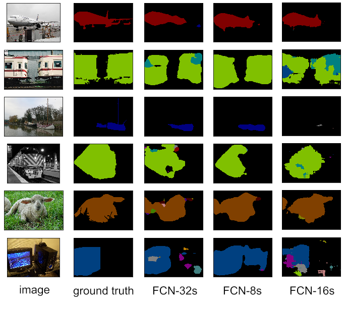

# FCN  
1. 使用voc2012数据集进行分割实例训练测试。数据集建立详见 `utils/dataset.py`  
    ```
    mkdir data
    mv VOCdevkit/VOC2012/JPEGImages data/images
    mv VOCdevkit/VOC2012/SegmentationClass data/classes
    ```
    在建立数据集时，可以采用直接读取文件夹里的图像建立数据集，然后再自行随机划分训练集与验证集。  
    也可以参照 `\VOCdevkit\VOC2012\ImageSets\Segmentation\train.txt(val.txt)`，本实例中采用前者。  
2. FCN网络用于图像分割，模型搭建详见 `utils/model.py`  
    + FCN8x / FCN16x / FCN32x 使用vgg16作为backbone。  
    + FCN8s 使用resnet34作为backbone。 
    + 使用双线性卷积核初始化反卷积核参数。   
    + 网络反卷积部分设计中可以添加一些batchnorm层，relu或者leakyrelu层等。 
3. voc数据集分割类别对应有相应的颜色，故要对label进行一定的变换。详见 `utils/transfrom.py`  
    
4. 数据预处理中并没有对image和label进行resize，是因为label是像素级别上的标注，进行resize可能  
    会变成小数。故对其进行相同位置的random crop，自定义random crop。详见 `utils/transfrom.py`  
5. 图像分割衡量标准，具体实现见`utils/eval.py`。  
    参考网站：https://blog.csdn.net/majinlei121/article/details/78965435  
             https://blog.csdn.net/u014593748/article/details/71698246  
6. 目录结构  
    

7. 训练代码

   设置不同的对比实验：

   lr schedule： Cosine、Exponential、Multistep

   optimizer： SGD、Adam

1. 
python main.py --result_path='./result_fcn32s_SGD_Cosine.txt' --model_path='./models/fcn32s_SGD_Cosine_best_model.pth' --summarywriter_dir='./fcn32s_SGD_Cosine_runs' --lr_decay_choice='Cosine' --model='fcn32' --optim='SGD'

2. 
python main.py --result_path='./result_fcn32s_Adam_Cosine.txt' --model_path='./models/fcn32s_Adam_Cosine_best_model.pth' --summarywriter_dir='./fcn32s_Adam_Cosine_runs' --lr_decay_choice='Cosine' --model='fcn32' --optim='Adam'

3. python main.py --result_path='./result_fcn32s_Adam_Exp.txt' --model_path='./models/fcn32s_Adam_Exp_best_model.pth' --summarywriter_dir='./fcn32s_Adam_Exp_runs' --lr_decay_choice='Exponential' --model='fcn32' --optim='Adam'

4.   python main.py --result_path='./result_fcn32s_Adam_multistep.txt' --model_path='./models/fcn32s_Adam_multistep_best_model.pth' --summarywriter_dir='./fcn32s_Adam_Multistep_runs' --lr_decay_choice='multistep' --model='fcn32s' --optim='Adam'

5. 
   python main.py --result_path='./result_fcn16s_Adam_Cosine.txt' --model_path='./models/fcn16s_Adam_Cosine_best_model.pth' --summarywriter_dir='./fcn16s_Adam_Cosine_runs' --lr_decay_choice='Cosine' --model='fcn16s' --optim='Adam'

6. python main.py --result_path='./result_fcn8s_Adam_Cosine.txt' --model_path='./models/fcn8s_Adam_Cosine_best_model.pth' --summarywriter_dir='./fcn8s_Adam_Cosine_runs' --lr_decay_choice='Cosine' --model='fcn8s' --optim='Adam'